# Focused Architecture Diagrams

Clean, focused diagrams showing different aspects of the Generative Pattern Showcase architecture.

## 1. Core Application Flow

The main user interaction and pattern rendering pipeline:

```mermaid
graph LR
    User[👤 User] --> UI[Pattern Showcase UI]
    UI --> Controls[Control Panel]
    UI --> PatternList[Pattern Selection]
    
    PatternList --> Manager[Pattern Manager]
    Controls --> Manager
    
    Manager --> Interface[PatternGeneratorProps<br/>Interface]
    Interface --> Pattern[Selected Pattern<br/>Component]
    
    Pattern --> Renderer{Rendering<br/>Technology}
    Renderer -->|2D Patterns| Canvas[Canvas 2D]
    Renderer -->|3D/Particles| WebGL[WebGL + Shaders]
    
    Canvas --> Display[🖥️ Visual Output]
    WebGL --> Display
    
    classDef user fill:#e3f2fd,stroke:#1976d2
    classDef ui fill:#f3e5f5,stroke:#7b1fa2
    classDef core fill:#e8f5e8,stroke:#388e3c
    classDef render fill:#fff3e0,stroke:#f57c00
    
    class User user
    class UI,Controls,PatternList ui
    class Manager,Interface,Pattern core
    class Renderer,Canvas,WebGL,Display render
```

## 2. Plugin System Architecture

How new patterns integrate into the system:

## 3. Supporting Systems

The semantic layer, educational content, and optimization systems:

## 4. Data Flow Summary

High-level view of how data moves through the system:

## Benefits of This Approach

**Focused Diagrams:**
- Each diagram tells one clear story
- Easier to understand individual concepts
- Less visual clutter

**Scalable Documentation:**
- Can add new focused diagrams as needed
- Each diagram can evolve independently
- Better for presenting specific aspects to different audiences