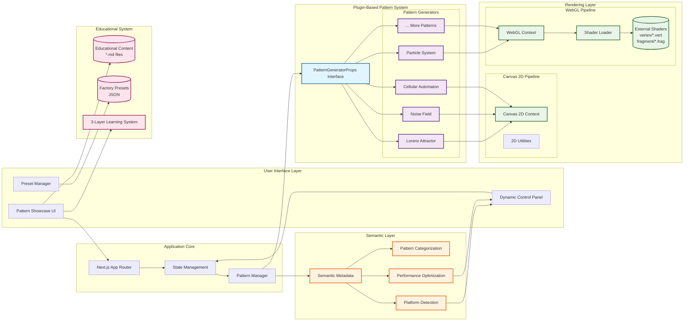

# Architecture Diagrams

This document contains Mermaid diagrams that illustrate the system architecture and workflows of the Generative Pattern Showcase.

## System Architecture Overview

## Quick Mermaid Learning Notes

**Basic Syntax:**
- `graph TB` = Top-to-Bottom flowchart
- `A --> B` = Arrow from A to B
- `A[Label]` = Rectangle node
- `A[(Database)]` = Cylinder/database shape
- `subgraph "Title"` = Grouped section

**Styling:**
- `classDef className fill:#color,stroke:#color` = Define style
- `class NodeName className` = Apply style to node

**Common Shapes:**
- `A[Rectangle]`
- `A(Rounded)`
- `A{Diamond}`
- `A[(Database)]`
- `A[[Subroutine]]`

**Tools to View Mermaid:**
- GitHub (renders automatically in .md files)
- Mermaid Live Editor: https://mermaid.live/
- VS Code Mermaid Preview extension
- Many documentation platforms support it natively

## Additional Diagrams (Coming Soon)

*Placeholder for future diagrams:*
- AI Development Workflow
- Pattern Generator Interface (Class Diagram)
- Golden Rules Decision Tree
- Semantic Layer Structure