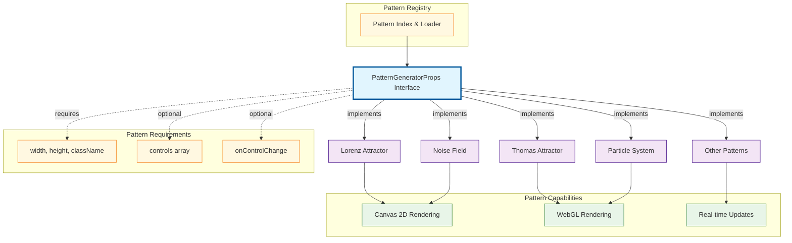

# Plugin System Architecture

How new patterns integrate seamlessly into the Generative Pattern Showcase through a unified interface system.

## Overview

The plugin architecture allows completely different types of generative patterns (mathematical attractors, noise fields, particle systems) to integrate seamlessly while choosing their optimal rendering technology.

## Architecture Diagram

## Key Design Principles

**Unified Interface**: All patterns implement `PatternGeneratorProps`, ensuring consistent integration regardless of complexity or rendering approach.

**Technology Choice Freedom**: Patterns can choose Canvas 2D for geometric algorithms or WebGL for high-performance particle systems.

**Registry System**: Central pattern index manages discovery and loading, making it trivial to add new patterns.

**Flexible Requirements**: Core props are required, but controls and callbacks are optional, allowing simple patterns to stay simple.

## Benefits

- **Extensibility**: Adding new patterns requires only implementing the interface
- **Performance**: Each pattern uses its optimal rendering technology  
- **Maintainability**: Patterns are self-contained and independently testable
- **Consistency**: Unified interface ensures predictable behavior across all patterns