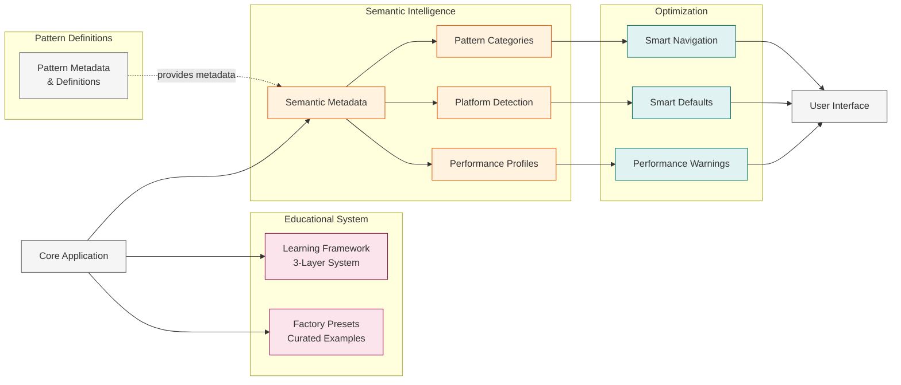

# Supporting Systems Architecture

The semantic layer, educational framework, and intelligent optimization systems that enhance the core pattern generation capabilities.

## Overview

Beyond pattern generation, the platform includes sophisticated supporting systems that provide semantic intelligence, educational content, and platform-aware optimizations.

## Architecture Diagram

## System Components

### Semantic Intelligence
**Rich Metadata**: Each pattern includes algorithmic family, mathematical concepts, visual characteristics, and performance profiles.

**Platform Detection**: Automatically identifies mobile vs desktop capabilities to optimize defaults.

**Performance Profiling**: Machine-readable performance impact ratings for all controls and features.

### Educational Framework
**3-Layer Learning System**:
- Layer 1 (Intuitive): "What is this?" - Visual descriptions and real-world connections
- Layer 2 (Conceptual): "How does this work?" - Algorithm mechanics and principles  
- Layer 3 (Technical): "Show me the mathematics" - Formal mathematical foundations

**Factory Presets**: Curated parameter combinations demonstrating mathematical significance, automatically imported and categorized.

### Optimization Systems
**Smart Defaults**: Platform-specific parameter values (e.g., particle trails disabled on mobile for performance).

**Performance Warnings**: Contextual alerts when users enable computationally expensive features.

**Smart Navigation**: Category-aware pattern browsing with intelligent grouping and discovery.

## Key Innovations

**Metadata-Driven Intelligence**: Unlike simple configuration systems, rich semantic data enables context-aware features.

**Educational Integration**: Seamless connection between interactive exploration and structured learning content.

**Platform Awareness**: Automatic optimization based on device capabilities and performance constraints.

**Extensible Framework**: New patterns automatically benefit from semantic features by providing appropriate metadata.